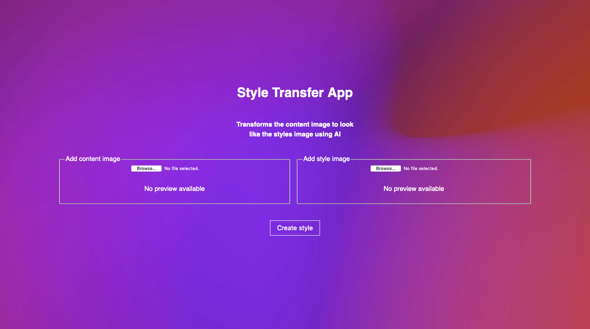

# Style Transfer App 



An app that use a hand-rolled Pytorch neural net that extracts styles from one image and applies them to another image.

# Why this project?

A big part of the Bertelsmann AI Developer scholarship was learning the basics of neural nets through building custom Multi-layered Perceptron Networks that process MNIST datasets.

Moving on from that baseline, the scholarhip explored Convolutional Neural Network architectures in order to highlight a more efficient way to extract meaning from images.

This project highlight the benefits of CNN by implementing the seminal paper from Gatys [Image Style Transfer Using Convolutional Neural Networks](https://www.cv-foundation.org/openaccess/content_cvpr_2016/papers/Gatys_Image_Style_Transfer_CVPR_2016_paper.pdf)in Pytorch. 

As in that paper we use a 19-layer VGG Network to extract content and style features. Then we build up the concepts of content and style loss and use those values to ultimately tweak the output image.

# What will I learn?

- Implementing a CNN in Pytorch
- Using a pre-trained model to achieve a new outcome
- Merging the AI functionality with a fullstack Python web UI using Flask 
- Deployment to AWS via the Serverless framework
- Implementing Gram matrices and custom loss values

# Running the app

## Pre-requisites 

* Python3
* Computer with a GPU or a Colab account (for the ML code)
* [Serverless framework CLI](https://serverless.com/framework/docs/getting-started/) (only for deployment)
* [Amazon Web Services](https://aws.amazon.com/) account (only for deployment)
* [Amazon Web Services CLI](https://github.com/aws/aws-cli) connected to your account (only for deployment)
* Optional - [Serverless Framework account](serverless.com/)

## Environment setup 

Create a venv folder (on MacOS)

```zsh
python3 -m venv venv
```

Activate the environment

```zsh
. venv/bin/activate
```

## Installation

Use the package manager [pip3](https://pip.pypa.io/en/stable/) to install app dependencies.

```bash
pip3 install -r requirements.txt
```

## Start the app

```zsh
python app.py
```
# Deployment

## Install 

Install the Serverless Framework plugins

```zsh
npm i
```

## Serve locally 

Leverage the Serverless WSGI pluging to serve the app locally before deployment

```zsh
sls wsgi serve
```

## Pre-deploy

- create an AWS account
- set up the AWS CLI to use your account
- install the Serverless Framework CLI

## Deployment 

Deploy using the Serverless Framework. 

```zsh
sls serve
```

Done? Good! 🎉 

Your enpoints will be there in the console.

# Attributions

- Bertelsmann AI developer scholarship, Udacity for the training and Style Transfer CNN example
- Pytorch website for the [lovely background](https://pytorch.org/assets/images/home-background.jpg)

# Contributing

Pull requests are welcome. For major changes, please open an issue first to discuss what you would like to change.

Please make sure to update tests as appropriate.

# License

[MIT](https://choosealicense.com/licenses/mit/)
